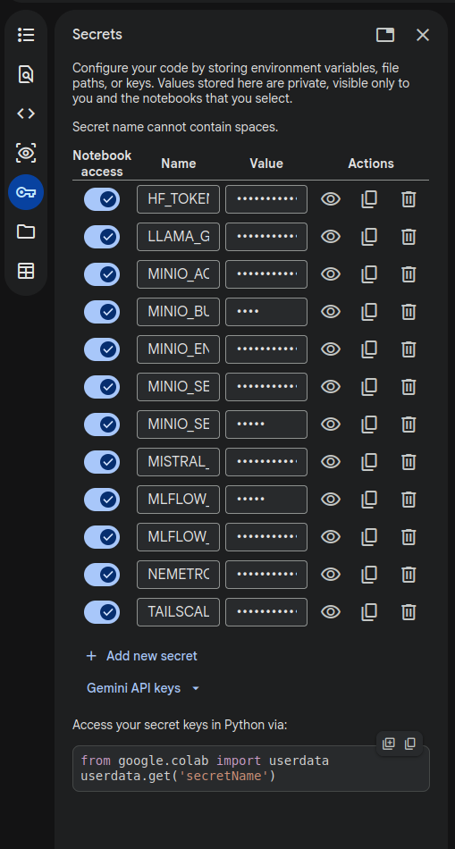

# Google Colab

[Colab](https://colab.research.google.com/) is really strong unit for traing ML models in python, Scala and R. On free tire it could be used ~ 10 hours with T4 GPU (which give 16 GB RAM and 16 GB VRAM).

## Secrets

Secrets are provided once in secrets and you chose which one to give to the current notbook permission to view those sicrets.

## Cons
- [Colab VsCode extention](https://marketplace.visualstudio.com/items?itemName=Google.colab) could not read secrets from the local envirement or from Colab secrets
- MlFlow ML monitoring is not straightforward as in [local](Local.md) development and should be hosted somewhere.

## My solution:
- k3s - Kuberneties that could be used even on RPI 5 with 8GB RAM
- MlFlow - Official image
- PostgreSQL - Database for storing metrics and experiments
- MiniO - Store artifacts, models and larege files from MlFlow
- Tailscale - Free VPN and reverse tunenling that gives apprtunity for safety exposing resources with using Tailscale VPN infrastructure.