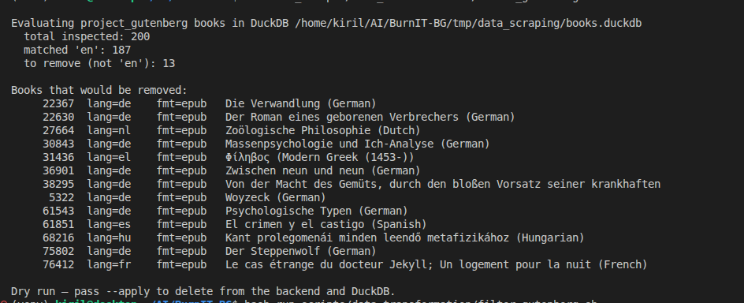

# run_scripts/data_transformation — bash wrappers

Thin shell wrappers over the [`data_transformation`](../../data_transformation/)
CLI. The Python lives there; these scripts just plug in defaults and pass
flags through.

## Scripts

| File | Wraps |
| --- | --- |
| `filter_gutenberg.sh` | `python -m data_transformation filter-language …` |
| `translate.sh` | `python -m data_transformation translate …` |
| `hf_mental_health_counseling_conversations_dataset.sh` | `python -m data_transformation hf-dataset …` |
| `kaggle_mental_health_dataset.sh` | `python -m data_transformation kaggle-dataset …` |

## `filter_gutenberg.sh` — drop non-English Gutenberg books

Dry run (recommended first):

```bash
./run_scripts/data_transformation/filter_gutenberg.sh
```



Apply the deletions to MinIO + DuckDB, then re-upload the refreshed
manifest:

```bash
APPLY=1 ./run_scripts/data_transformation/filter_gutenberg.sh
```

Override defaults via env vars:

| Variable | Default | What it does |
| --- | --- | --- |
| `SOURCE` | `project_gutenberg` | Manifest source to filter. |
| `KEEP_LANG` | `en` | Language code to keep. |
| `BACKEND` | `minio` | Storage backend the books were saved to: `minio`, `local`, or `huggingface`. |
| `BUCKET` | (none) | Bucket name for `minio` backend; defaults to env `MINIO_BUCKET` or `data`. |
| `LIMIT` | (none) | Stop after inspecting N books — useful for a quick spot check. |
| `APPLY` | `0` | Set to `1`/`true` to actually delete and re-upload. |

```bash
LIMIT=20 ./run_scripts/data_transformation/filter_gutenberg.sh         # peek at the first 20 books
APPLY=1 LIMIT=200 ./run_scripts/data_transformation/filter_gutenberg.sh # delete from first 200
```

## `translate.sh` — translate fields in a dataset

`INPUT` and `OUTPUT` are required; everything else has sensible defaults
(en → bg via free Google Translate).

```bash
INPUT=tmp/data_scraping/_tmp/books.parquet \
OUTPUT=tmp/data_transformation/books.bg.jsonl \
FIELDS=title,summary \
    ./run_scripts/data_transformation/translate.sh
```

| Variable | Default | What it does |
| --- | --- | --- |
| `INPUT` | *(required)* | Path to the input file. Format detected from extension (`.jsonl`, `.json`, `.csv`, `.parquet`, plain text). |
| `OUTPUT` | *(required)* | Path to the output file. |
| `FIELDS` | (none) | Comma-separated dotted field paths. Omit to translate every top-level string field. |
| `SOURCE_LANG` | `en` | Source language code. |
| `TARGET_LANG` | `bg` | Target language code. |
| `DELAY` | `0.0` | Seconds slept between API calls. Increase if you see rate-limit errors. |
| `CACHE` | `tmp/data_transformation/translate_cache.json` | Translation cache JSON. Reused across runs. |

## `hf_dataset.sh` — download a HuggingFace dataset, translate, push everywhere

End-to-end pipeline: snapshot a HF dataset, translate selected fields,
upload both the raw snapshot and the translated copy to MinIO **and** the
matching HF Bucket.

```bash
# Translate Context and Response into Bulgarian, push to MinIO and HF
REPO=Amod/mental_health_counseling_conversations \
FIELDS=Context,Response \
DELAY=0.3 \
    ./run_scripts/data_transformation/hf_dataset.sh
```

| Variable | Default | What it does |
| --- | --- | --- |
| `REPO` | *(required)* | HuggingFace dataset id (`owner/name`). |
| `FIELDS` | (none) | Comma-separated field paths to translate. Omit to translate every top-level string field. |
| `SOURCE_LANG` | `en` | Source language code. |
| `TARGET_LANG` | `bg` | Target language code. |
| `DELAY` | `0.0` | Seconds slept between API calls; bump if you hit rate limits. |
| `BUCKET` | env `MINIO_BUCKET` or `data` | MinIO bucket. |
| `MINIO_PREFIX` | `datasets/huggingface` | Key prefix inside the bucket. Final path: `{bucket}/{prefix}/{slug}/{raw|target_lang}/...`. |
| `HF_BUCKET` | `data` | HuggingFace bucket id. Bare names are auto-qualified to `{whoami}/{name}`. |
| `HF_PREFIX` | `datasets/huggingface` | Prefix inside the HF bucket. |
| `SKIP_DOWNLOAD` | `0` | Reuse an already-downloaded snapshot under `tmp/`. |
| `SKIP_TRANSLATE` | `0` | Skip translation (still uploads `raw/`). |
| `SKIP_MINIO` | `0` | Skip MinIO upload. |
| `SKIP_HF` | `0` | Skip HF Bucket upload. |

Re-running with the same `REPO`/`FIELDS`/`TARGET_LANG` reuses the
translation cache, so re-runs only call the translation API for new
strings.

## `kaggle_mental_health_dataset.sh` — download a Kaggle dataset, translate, push everywhere

Same end-to-end pipeline as `hf_dataset.sh`, but the source is a Kaggle
dataset handle instead of a HuggingFace repo id. Uses
[`kagglehub`](https://github.com/Kaggle/kagglehub) under the hood — set
credentials once via `~/.kaggle/kaggle.json` or the `KAGGLE_USERNAME` /
`KAGGLE_KEY` environment variables.

```bash
# Default — preset points at nguyenletruongthien/mental-health
./run_scripts/data_transformation/kaggle_mental_health_dataset.sh

# Override the source dataset and the fields to translate
HANDLE=othel/another-dataset \
FIELDS=question,answer \
DELAY=0.3 \
    ./run_scripts/data_transformation/kaggle_mental_health_dataset.sh
```

| Variable | Default | What it does |
| --- | --- | --- |
| `HANDLE` | `nguyenletruongthien/mental-health` | Kaggle dataset id (`owner/dataset-name`). |
| `VERSION` | (latest) | Pin a specific dataset version. |
| `FORCE_DOWNLOAD` | `0` | Re-download even when kagglehub already cached the snapshot. |
| `FIELDS` | (auto-detect) | Comma-separated field paths to translate. Omit to translate every top-level string field. |
| `SOURCE_LANG` / `TARGET_LANG` | `en` / `bg` | Translation pair. |
| `DELAY` | `0.3` | Seconds slept between API calls. |
| `BUCKET` | env `MINIO_BUCKET` or `data` | MinIO bucket. |
| `MINIO_PREFIX` | `datasets/kaggle` | Key prefix inside MinIO bucket. Final path: `{bucket}/{prefix}/{slug}/{raw|target_lang}/...`. |
| `HF_BUCKET` | `data` | HuggingFace bucket id. Bare names are auto-qualified to `{whoami}/{name}`. |
| `HF_PREFIX` | `datasets/kaggle` | Prefix inside the HF bucket. |
| `SKIP_DOWNLOAD` / `SKIP_TRANSLATE` / `SKIP_MINIO` / `SKIP_HF` | `0` | Disable individual pipeline stages. |

The HuggingFace and Kaggle pipelines share the same translate / upload
code path, so the resulting `raw/` and `{target_lang}/` layouts on MinIO
and the HF bucket are identical between the two sources.

## Direct CLI use

If you need flags that aren't exposed by the wrappers, call the module
directly:

```bash
venv/bin/python -m data_transformation translate --help
venv/bin/python -m data_transformation filter-language --help
venv/bin/python -m data_transformation hf-dataset --help
venv/bin/python -m data_transformation kaggle-dataset --help
```


